# Validación junto al dato que necesita corrección

Capturas reales con Chromium, 390 × 844 y comprobación adicional a 320 px, con Inter Variable y Manrope Variable cargadas. Antes: app local 5173 (validación de master; esa copia permite además inicios en los últimos 30 días, diferencia que no interviene en estas capturas con inicio hoy). Después: rama `ux/contextual-form-validation`, puerto 5186. Fecha de captura: 16 de septiembre de 2026.

Escenarios sintéticos iguales en ambos lados: «Escapada a Lisboa 2026», Ana y Bruno; grupo «UX · Validación» con Ana, Bruno y Carla, importe «12,345» y concepto «Cena compartida»; después importe corregido a 30 € sin participantes. No se incluyen enlaces de acceso, cookies ni identificadores de grupo.

| Escenario | Antes | Después |
| --- | --- | --- |
| Nombre demasiado largo, documento completo | 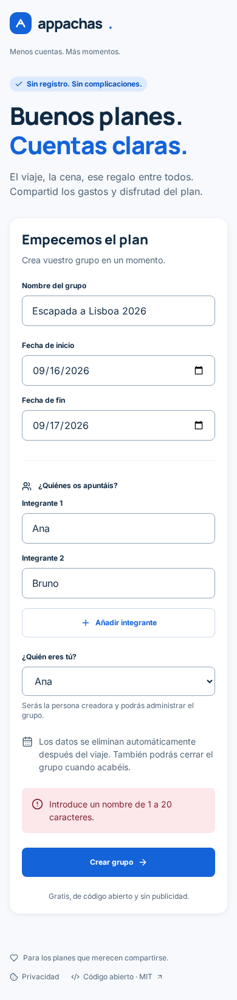 | 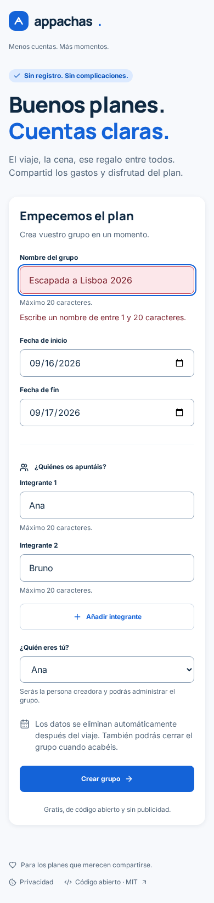 |
| Vista al enviar: el foco vuelve al nombre | 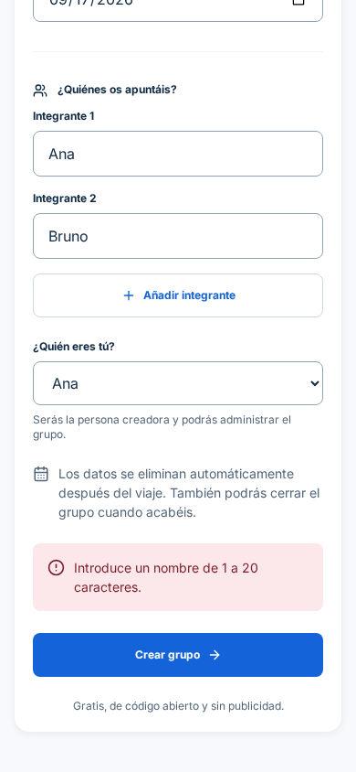 | 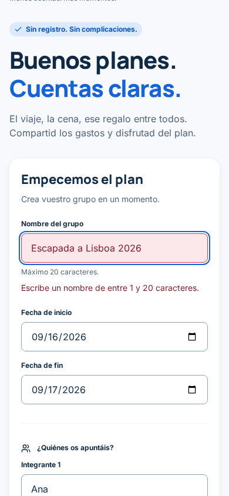 |
| Importe con más de dos decimales | 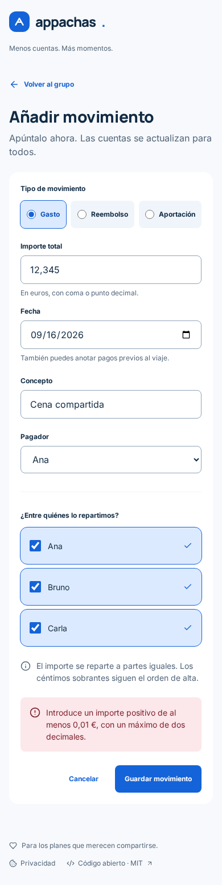 | 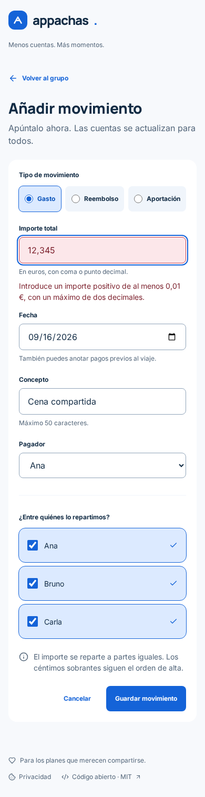 |
| Sin participantes seleccionados | 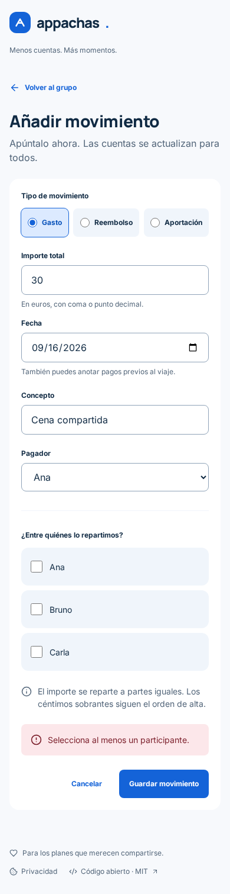 | 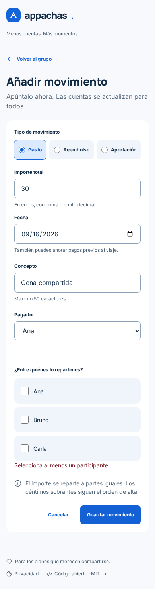 |
| Nombre a 320 px | 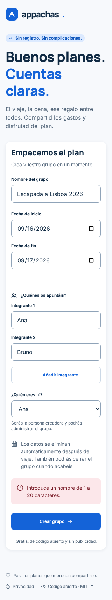 | 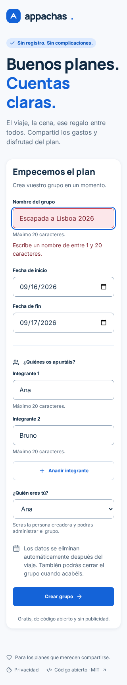 |
| Movimiento a 320 px | 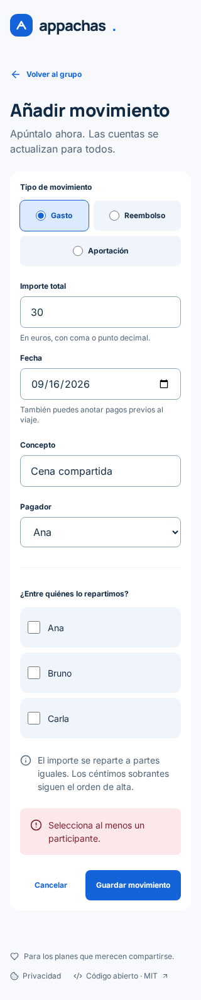 | 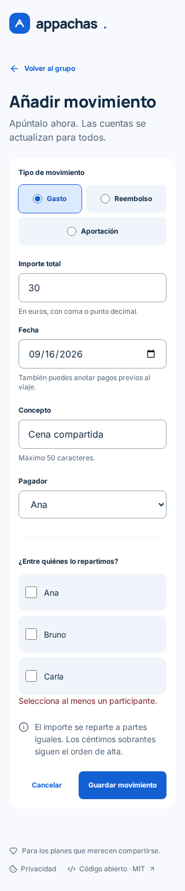 |

## Justificación

La [ley de proximidad](https://lawsofux.com/law-of-proximity/) apoya situar el mensaje bajo el campo o conjunto de participantes correspondiente. Los límites visibles antes de enviar y el foco en el primer error buscan reducir [carga cognitiva](https://lawsofux.com/cognitive-load/): ya no hay que recordar un mensaje al final mientras se busca su origen. Es una hipótesis de diseño, no una mejora medida con usuarios.

Se siguen los requisitos de `DESIGN.md`: ayudas y errores debajo del campo, superficie error-soft y texto error-text, mensaje explícito además del color y foco azul existente. La validación conserva el borrador y los errores de red generales. No cambia las fechas permitidas ni el algoritmo de reparto.

## Validación

- `npm run check`, `npm test` (68 pruebas) y `npm run build`: correctos.
- Pruebas nuevas: foco/descripción accesible y conservación del nombre largo sin envío, 20 puntos de código Unicode aceptados como en el backend, alias duplicado con foco en su campo.
- Navegador/API real: foco en nombre, importe y participantes; corrección de importe/participante y movimiento guardado; sin desbordamiento horizontal a 390/320 px.
- Axe WCAG 2/2.1 A/AA: cero incidencias en el formulario de movimiento con error de participantes. No sustituye una auditoría manual con lector de pantalla.
