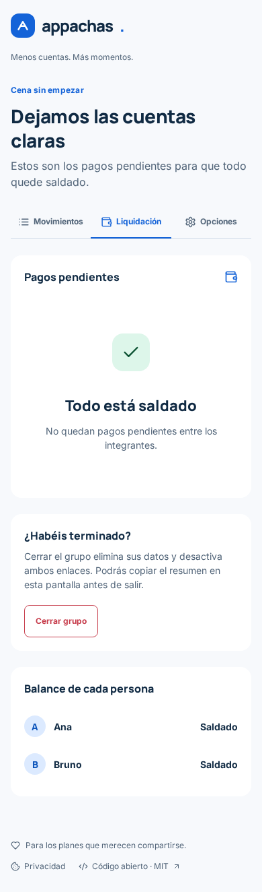
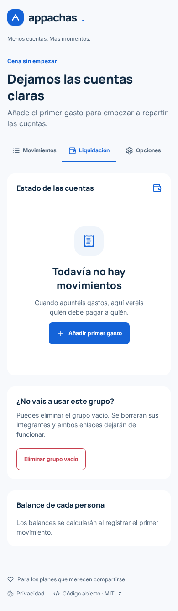
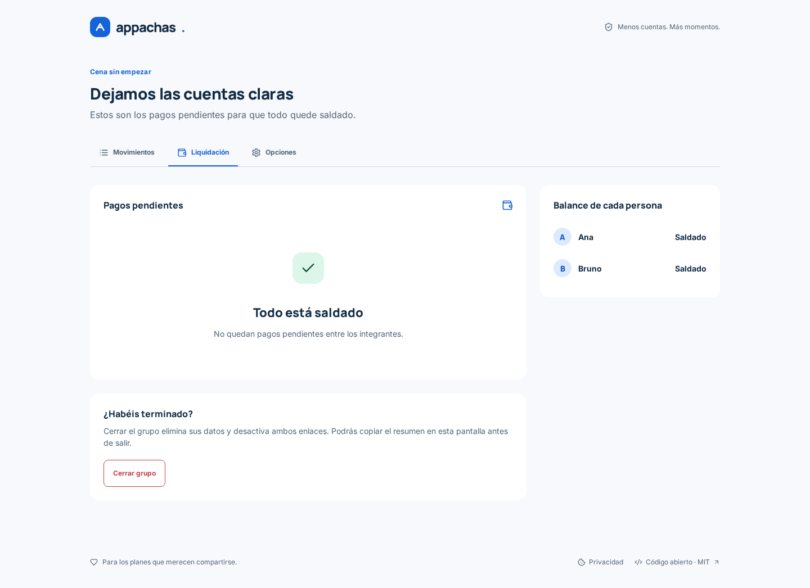
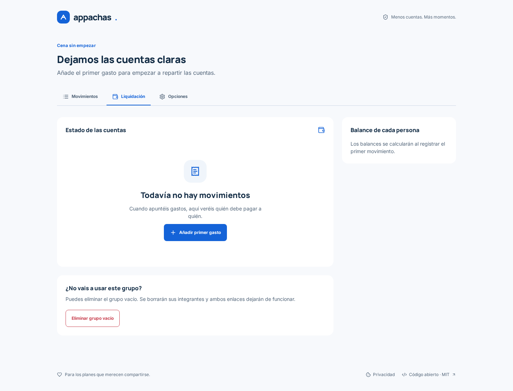
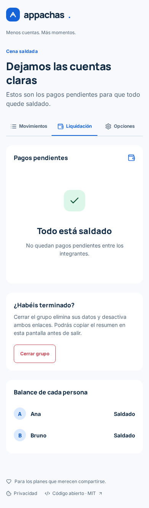
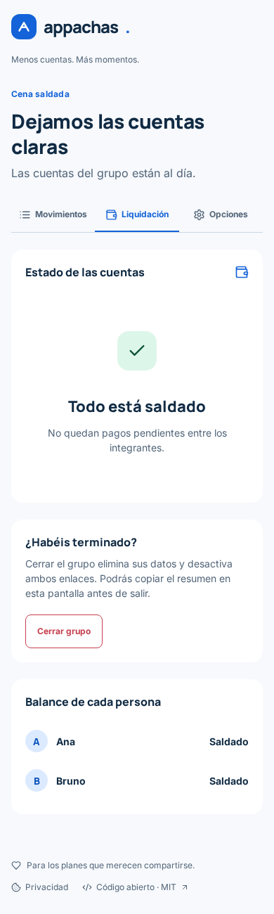
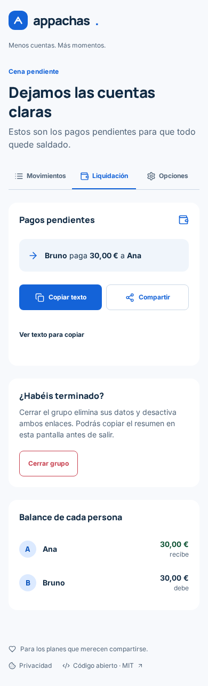

# Liquidación: vacío, pendiente y saldado

Un grupo sin movimientos mostraba «Todo está saldado», balances «Saldado» y una invitación a terminar. Ahora explica que aún no hay movimientos y ofrece «Añadir primer gasto». El creador puede eliminar el grupo vacío mediante una acción secundaria con confirmación. Cuando sí existe actividad, se distinguen pagos pendientes y cuentas saldadas.

La justificación es el [modelo mental](https://lawsofux.com/mental-model/): comenzar y terminar son momentos distintos aunque ambos tengan un saldo numérico cero. Se usan los componentes, tipografías, colores semánticos y objetivos táctiles existentes de `DESIGN.md`; el verde queda reservado a la confirmación de cuentas saldadas.

## Evidencia visual

Capturas reales de Chromium con API/PostgreSQL locales, datos ficticios, misma semilla antes y después, sin tokens en pantalla. Inter y Manrope latinas verificadas como cargadas antes de cada captura. El antes corresponde a la interfaz base `4503e99`; el después a este cambio. Capturas completas en 390, 1440 y 320 px, sin desbordamiento horizontal.

Semilla: Ana y Bruno; grupo vacío sin movimientos; grupo pendiente con cena de 60 € pagada por Ana; grupo saldado con la misma cena y aportación compensatoria de 30 € de Bruno a Ana.

| Estado, ancho | Antes | Después |
| --- | --- | --- |
| Vacío, 390 |  |  |
| Vacío, 1440 |  |  |
| Saldado, 390 |  |  |
| Pendiente, 390 |  |  |

Las variantes 320 px y escritorio de los otros estados están en esta misma carpeta.

## Validación

- `npm --prefix frontend run check`: formato, lint y TypeScript.
- Pruebas de navegador en `e2e/tests/mobile.spec.ts`: liquidación/copiar/compartir/cierre; grupo realmente saldado; vacío, CTA de primer gasto, cancelar y confirmar eliminación; accesibilidad de pantallas principales.
- El caso vacío verifica Axe WCAG 2 A/AA y 2.1 AA, objetivos táctiles de 44 px y ausencia de desbordamiento a 320/390 px con texto al 200 %.
- El test previo «settled groups» creaba un grupo sin movimientos. Ahora crea gasto y aportación compensatoria, evitando que vuelva a confundir ambos estados.

La hipótesis UX queda pendiente de validar con personas usuarias; estas comprobaciones verifican comportamiento y presentación.
