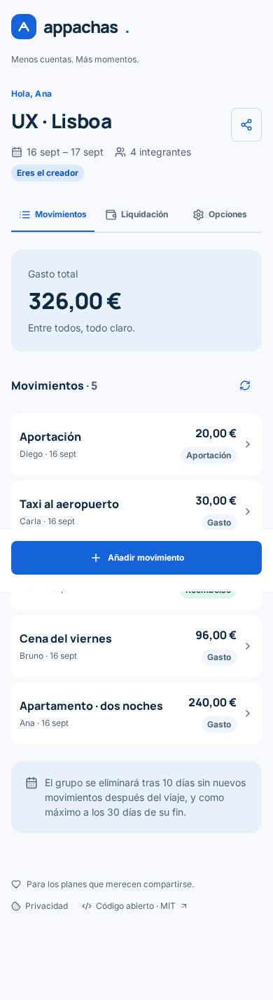
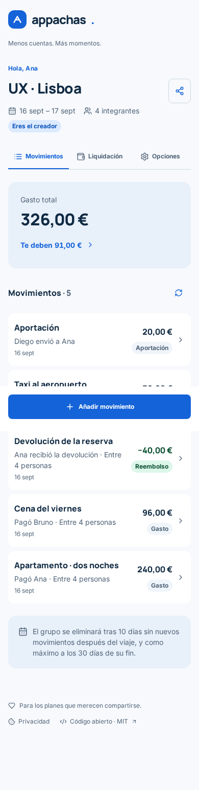
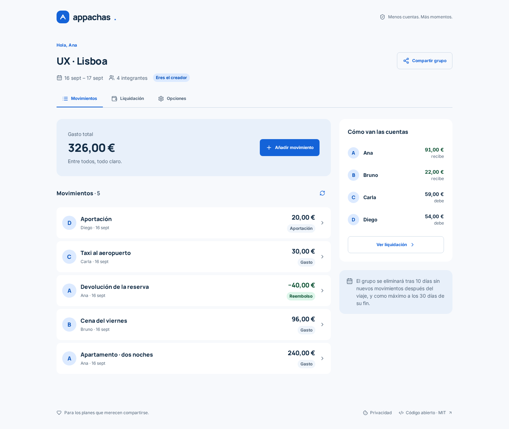
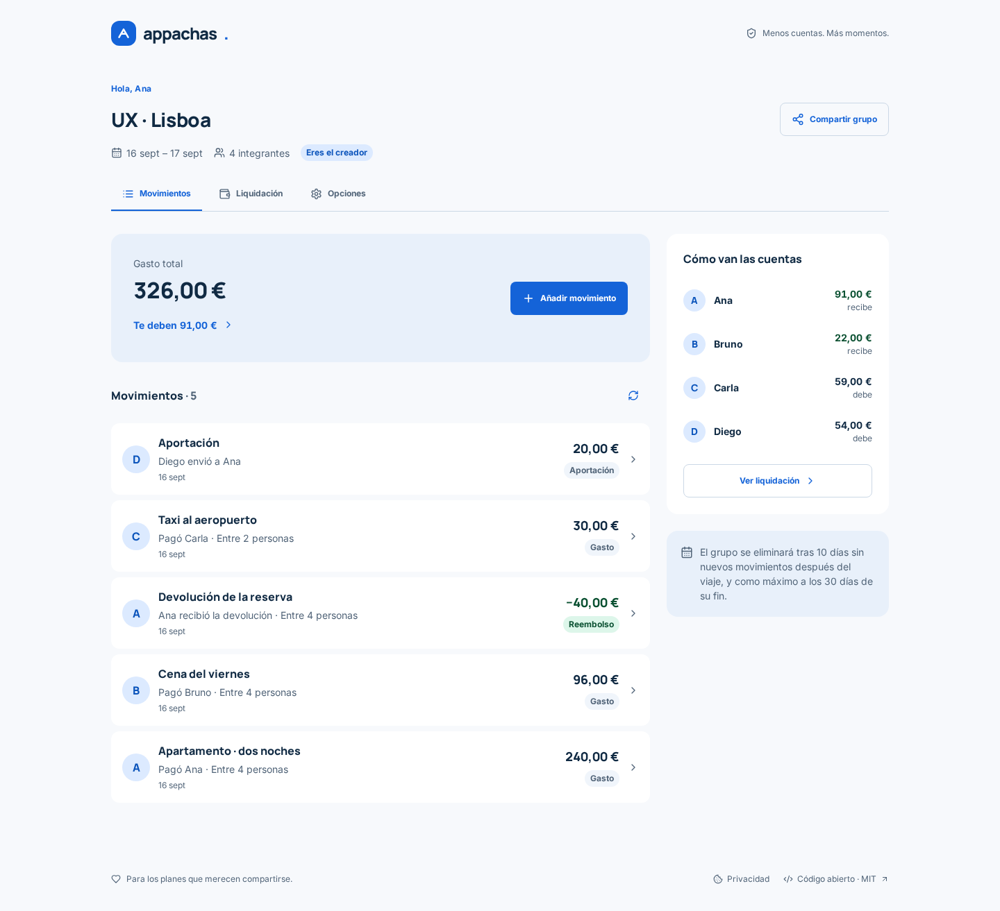
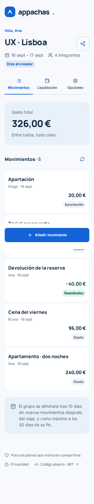
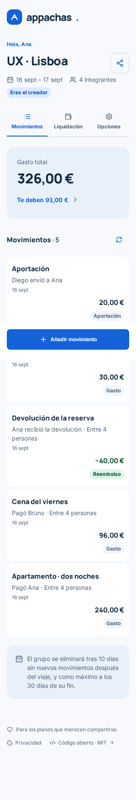
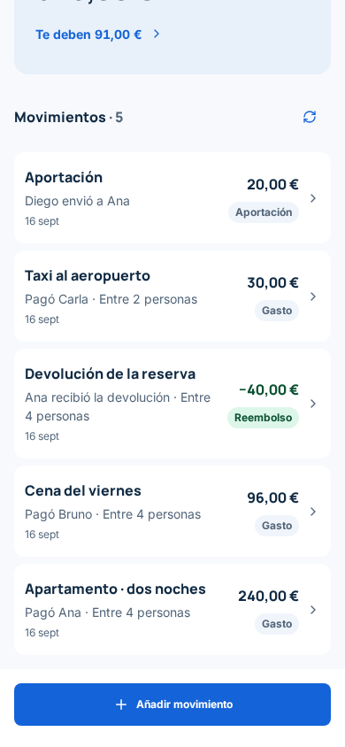
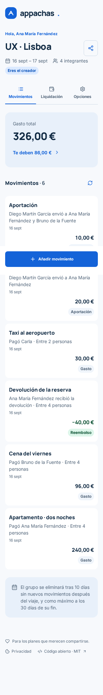

# Saldo personal y contexto de movimientos

El resumen muestra el saldo de la identidad activa y enlaza a Liquidación: «Te deben», «Debes» o «Tu cuenta está saldada». Sin actividad muestra «Tu saldo: 0,00 €». Las filas explican quién pagó y entre cuántas personas se reparte, quién recibió una devolución y a quién se envió una aportación (incluidos varios receptores).

Esto reduce la información que hay que recordar o buscar en otra pantalla y acerca el historial al modelo mental de quien anota gastos. Se conserva Mesa Clara: superficies y colores existentes, importes tabulares, texto explícito y enlace de al menos 44 px. El contexto está asociado al enlace de edición mediante `aria-describedby`.

## Evidencia

Capturas reales de Chromium, con Inter y Manrope cargadas, de una misma semilla local: Ana, Bruno, Carla y Diego; apartamento 240 €, cena 96 €, devolución 40 €, taxi 30 € entre dos personas y aportación de Diego a Ana de 20 €. Total 326 €; saldo de Ana 91 € a recibir. Fechas 16–17 de septiembre de 2026. Las capturas no incluyen enlaces ni credenciales.

| Vista | Antes | Después |
| --- | --- | --- |
| Móvil 390 px |  |  |
| Escritorio 1440 px |  |  |
| Móvil 320 px |  |  |

La barra fija móvil aparece en su posición de viewport en las capturas completas. El detalle desplazado permite revisar las filas que quedan detrás en esa composición:

Una segunda situación añade una aportación a dos receptores y nombres largos (Ana María Fernández, Bruno de la Fuente y Diego Martín García). No hay desbordamiento a 320, 390 ni 1440 px:

## Verificación

- Comprobación de formato y TypeScript; suite del frontend, incluidos saldo positivo, negativo, saldado, vacío y contexto accesible de los tres tipos de movimiento.
- Capturas y aserciones con API/backend reales: saldo de 91 €, aportación a Ana, taxi entre dos y devolución entre cuatro; ausencia de desbordamiento en los tres anchos.
- Suite móvil: 15 escenarios Chromium superados, incluidos accesibilidad a 320 px y ampliación de texto al 200 %. El escenario WebKit no puede arrancar porque faltan dependencias del sistema (`libicu74`, `libxml2`, `libflite1`); no se presenta como validado.
