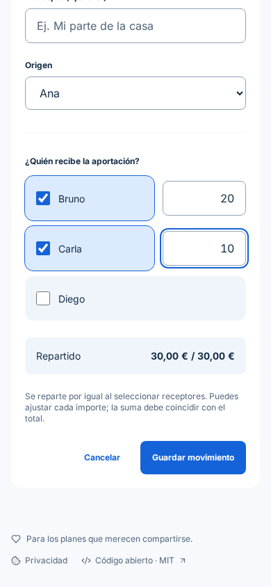
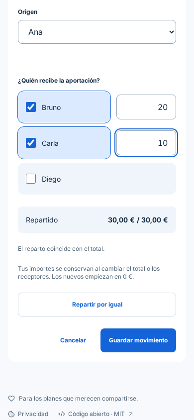
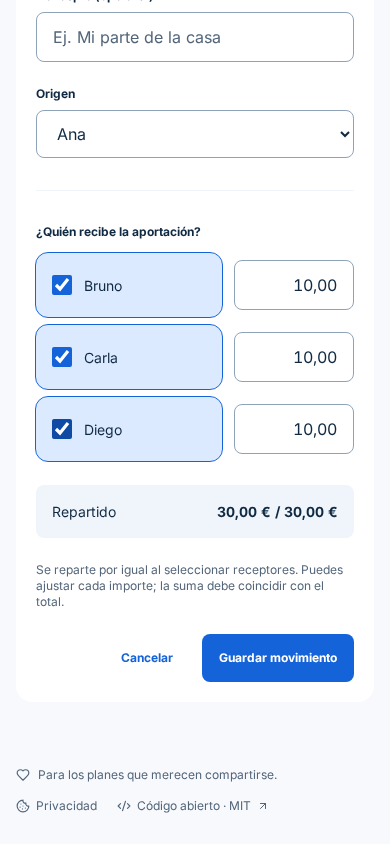
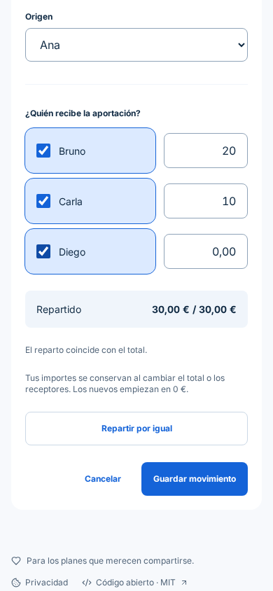
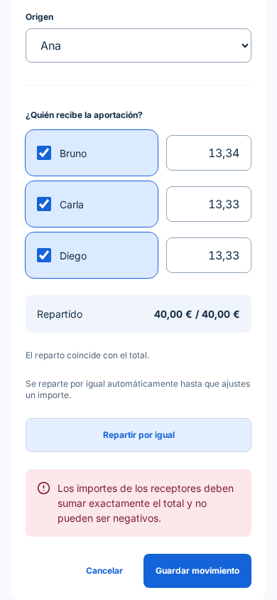
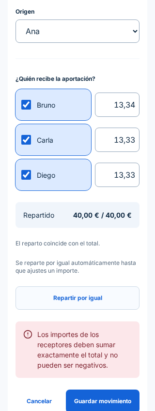

# Conservar el reparto manual de una aportación

El formulario sustituía silenciosamente una aportación de 30 € (Bruno 20 €, Carla 10 €) por 10/10/10 al seleccionar Diego. Al seguir sumando 30 €, podía guardarse sin que el usuario advirtiera el cambio.

Las capturas son del navegador Chromium real, con la aplicación local y un backend PostgreSQL real. Grupo ficticio «Reparto Lisboa», Ana, Bruno, Carla y Diego; viewport 390 × 844, salvo la comprobación final a 320 × 844. Las capturas muestran el tramo del formulario que contiene el origen, los receptores y el resumen. No incluyen secretos de acceso. El antes corresponde a `4503e99`; el después aplica este cambio.

| Paso | Antes | Después |
| --- | --- | --- |
| 1. Introducir Bruno 20 €, Carla 10 € |  |  |
| 2. Seleccionar Diego |  |  |

| 3. Cambiar el total a 40 € | 4. Pulsar «Repartir por igual» | 320 px |
| --- | --- | --- |
|  |  |  |

## Decisión y justificación

El reparto inicial sigue siendo automático. Editar cualquier importe cambia a preservación manual: añadir un receptor no modifica las cantidades existentes; un receptor nuevo empieza en cero. Desmarcar un receptor excluye su cantidad del total, y volver a marcarlo restaura su borrador. Cambiar de origen excluye al nuevo origen de los receptores. Las aportaciones ya guardadas se abren conservando sus cantidades. «Repartir por igual» sustituye explícitamente los importes y reactiva el cálculo automático, manteniendo el orden de alta para céntimos sobrantes.

Es una aplicación de la [ley de Tesler](https://lawsofux.com/teslers-law/): la app asume el cálculo y la comprobación de diferencias. La preservación de lo escrito responde al [modelo mental](https://lawsofux.com/mental-model/) de editar un campo sin que otro control reescriba importes previos. Es una hipótesis de diseño apoyada por la reproducción del problema, no una prueba de usabilidad con participantes.

Se reutilizan el botón secundario, los campos y el resumen de Mesa Clara (`DESIGN.md`). La diferencia se comunica con texto y región de estado accesible, sin depender del color. El botón de guardar sigue validando suma exacta e importes válidos; los cálculos y validación del backend no cambian.

## Validación

- `npm --prefix frontend run check`: Biome y TypeScript.
- `npm --prefix frontend test`: 70 pruebas, incluidas cinco regresiones nuevas de receptores, total/origen, guardado inválido, edición existente y cambio de tipo.
- `npm --prefix frontend run build`: compilación de producción.
- Navegador real: 20/10 se conserva como 20/10/0; cambiar total a 40 muestra que faltan 10; guardar con suma incorrecta se rechaza; reparto explícito 13,34/13,33/13,33 se guarda y reaparece igual tras recargar y abrir el movimiento.
- Comprobación a 320 px: ancho del documento no supera el viewport.
